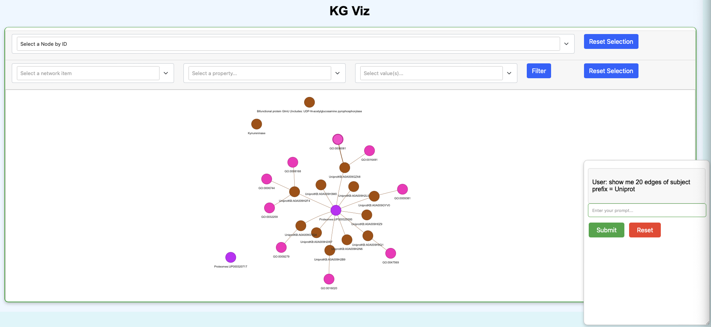

# kg-chat

LLM-based chatbot that queries and visualizes [`KGX`](https://github.com/biolink/kgx) nodes and edges TSV files loaded into either [`DuckDB`](https://github.com/duckdb/duckdb) (default) or [`neo4j`](https://github.com/neo4j/neo4j) database backend.

## LLMs Supported

| **LLM Provider**            | **Models**                                                                                   |
|-----------------------------|----------------------------------------------------------------------------------------------|
| OpenAI                      | - `gpt-4o-2024-08-06`<br>- `gpt-4o-mini`<br>- `gpt-4o-mini-2024-07-18`<br>- `gpt-4o-2024-05-13`<br>- `gpt-4o`<br>- `gpt-4-turbo-2024-04-09`<br>- `gpt-4-turbo`<br>- `gpt-4-turbo-preview` |
| Anthropic                   | - `claude-3-5-sonnet-20240620`<br>- `claude-3-opus-20240229`<br>- `claude-3-sonnet-20240229`<br>- `claude-3-haiku-20240307` |
| Ollama                      | - `llama3.1`                                                                                 |
| [LBNL-hosted models via CBORG](https://cborg.lbl.gov)      | - `lbl/llama-3` (actually 3.1 (405b))<br>- `openai/gpt-4o-mini`<br>- `anthropic/claude-haiku`<br>- `anthropic/claude-sonnet`<br>- `anthropic/claude-opus` |


## **:warning:**

- **OpenAI**:  Ensure `OPENAI_API_KEY` is set as an environment variable.

- **Anthropic**:  Ensure `ANTHROPIC_API_KEY` is set as an environment variable.

- **Ollama**: Better results if the `llama 3.1 405b` model is used. Needs GPU.
  - No API key required.
  - Download the application from [here](https://ollama.com/download) and install it locally.
  - Get any model of your choice but make sure the model has the `Tools` badge for it to work.
    Here's an example:
    ```shell
        ollama run llama3.1:405b
    ```
- **Models hosted by Lawrence Berkeley National Laboratory via CBORG**: Ensure `CBORG_API_KEY` is set as an environment variable.
  - The list of modes can be found [here](https://cborg.lbl.gov/models/) listed under "LBNL_Hosted Models".


#### How to set the API key as an environment variable?
One quick way is 
```shell
    export OPENAI_API_KEY=XXXXXX
    export ANTHROPIC_API_KEY=XXXXX
    export CBORG_API_KEY=XXXX
```
But if you want these to persist permanently
```shell
    vi ~/.bash_profile
```

OR

```
    vi ~/.bashrc
```
Add the 2 lines exporting the variables above and then
```shell
    source ~/.bash_profile
```
OR
```
    source ~/.bashrc
```

## Setup

### For Neo4j Backend (Optional)
1. Install Neo4j desktop from [here](https://neo4j.com/download/).
2. Create a new project and database, then start it.
3. Install the APOC plugin in Neo4j Desktop.
4. Update settings to match [`neo4j_db_settings.conf`](conf_files/neo4j_db_settings.conf).

### General Setup 

#### For Developers 
1. Clone this repository.
2. Create a virtual environment and install dependencies:
    ```shell
    cd kg-chat
    pip install poetry
    poetry install
    ```
3. Replace [`data/nodes.tsv`](data/nodes.tsv) and [`data/edges.tsv`](data/edges.tsv) with desired KGX files if needed.

### For using kg-chat as a dependency

```shell
pip install kg-chat
```
OR
```shell
poetry add kg-chat@latest
```

### Supported Backends
- DuckDB [default]
- Neo4j

### Commands

1. **Import KG**: Load nodes and edges into a database (default: duckdb).
    ```shell
    poetry run kg import --data-dir data
    ```

2. **Test Query**: Run a test query. 
   > **:warning:** `--data-dir` is a required parameter for all commands. This is the path for the directory which contains the nodes.tsv and edges.tsv file. The filenames are expected to be exactly that.
    ```shell
    poetry run kg test-query --data-dir data
    ```

3. **QnA**: Ask questions about the data.
    ```shell
    poetry run kg qna "how many nodes do we have here?" --data-dir data
    ```

4. **Chat**: Start an interactive chat session.
    ```shell
    poetry run kg chat --data-dir data
    ```

5. **App**: Deploy a local web application.
    ```shell
    poetry run kg app --data-dir data
    ```

### Visualization
Use `show me` in prompts for KG visualization.



---
### Acknowledgements

This [cookiecutter](https://cookiecutter.readthedocs.io/en/stable/README.html) project was developed from the [monarch-project-template](https://github.com/monarch-initiative/monarch-project-template) template and will be kept up-to-date using [cruft](https://cruft.github.io/cruft/).
