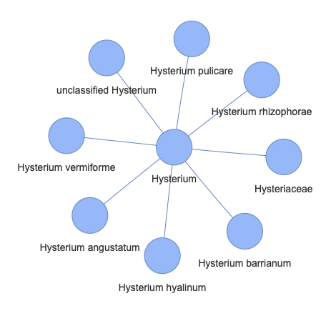

# kg-chat

Chatbot that looks up information from provided [KGX](https://github.com/biolink/kgx) files (nodes and edges TSV files). It uses [`langchain`](https://github.com/langchain-ai/langchain) and [`neo4j`](https://github.com/neo4j/neo4j) under the hood.


With GitHub, I usually insert a blockquote.

> **_NOTE:_**: This project assumes that you have `OPENAI_API_KEY` already set as an environmental variable.

## Requirements
- Neo4j Desktop

## Setup

1. Install Neo4j desktop from [here](https://neo4j.com/download/?utm_source=Google&utm_medium=PaidSearch&utm_campaign=Evergreen&utm_content=AMS-Search-SEMBrand-Evergreen-None-SEM-SEM-NonABM&utm_term=download%20neo4j&utm_adgroup=download&gad_source=1&gbraid=0AAAAADk9OYqwuLc9mMDBV2n4GXbXo8LzS&gclid=Cj0KCQjwv7O0BhDwARIsAC0sjWOzlSRw10D0r0jnxU2FtVs1MlC1lMVhl2GqH8pa4HAoaVS85DQO9nsaArSfEALw_wcB)

2. Create a new project by giving it a name of your choice
3. Create an empty database with a name of your choice and `Start` it.
    - Credentials can be as declared [here](https://github.com/hrshdhgd/kg-chat/blob/9ffd530e0da60da772403a327707fc3128d916e5/src/kg_chat/constants.py#L11-L12)
4. Install the APOC plugin in Neo4j Desktop. It is listed under the `Plugins` tab which appears when you single-click the database.
5. Click on `Settings` which is visible when you click on the 3 dots that appears to the right of the db on single-clicking as well. It should match []`neo4j_db_settings.conf`](https://github.com/hrshdhgd/kg-chat/blob/main/neo4j_db_settings.conf)
4. Clone this repository locally
5. Create a virtual environment of your choice and `pip install poetry` in it.
6. 
    ```shell
    cd kg-chat
    poetry install
    ```
8. replace the `data/nodes.tsv` and `data/edges.tsv` file in the project with corresponding files of choice that needs to be queried against.


### Commands

1. `import-kg`: This loads the nodes and edges file into a Neo4j instance. This will take a while depending on the size of the tsv files.
    ```shell
    kg-chat import-kg
    ```
    
2. `test-query`: To test that the above worked, run a built-in test query:
    ```shell
    kg-chat test-query
    ```
    This should return something like (as per KGX data in the repo):
    ```shell
    {'n': {'label': 'Streptomyces thermocarboxydovorans', 'id': 'NCBITaxon:59298'}}
    {'n': {'label': 'Streptomyces thermocarboxydus', 'id': 'NCBITaxon:59299'}}
    {'n': {'label': 'Streptomyces thermogriseus', 'id': 'NCBITaxon:75292'}}
    {'n': {'label': 'Streptomyces thermospinosisporus', 'id': 'NCBITaxon:161482'}}
    {'n': {'label': 'Streptomyces vitaminophilus', 'id': 'NCBITaxon:76728'}}
    {'n': {'label': 'Streptomyces yanii', 'id': 'NCBITaxon:78510'}}
    {'n': {'label': 'Kitasatospora azatica', 'id': 'NCBITaxon:58347'}}
    {'n': {'label': 'Kitasatospora paracochleata', 'id': 'NCBITaxon:58354'}}
    {'n': {'label': 'Kitasatospora putterlickiae', 'id': 'NCBITaxon:221725'}}
    {'n': {'label': 'Kitasatospora sampliensis', 'id': 'NCBITaxon:228655'}}
    ```

3. `qna`: This command can be used for asking a question about the data and receiving a response.
    ```shell
    kg-chat qna "give me the sorted (descending) frequency count nodes with relationships. Give me label and id. I want this as a table "
    ```
    This should return
    ```shell
    > Entering new GraphCypherQAChain chain...
    Generated Cypher:
    MATCH (n:Node)-[r:RELATIONSHIP]->(m:Node)
    RETURN n.label AS label, n.id AS id, COUNT(r) AS frequency
    ORDER BY frequency DESC
    Full Context:
    [{'label': 'hydrocarbon', 'id': 'CHEBI:24632', 'frequency': 2381}, {'label': 'Marinobacterium coralli', 'id': 'NCBITaxon:693965', 'frequency': 55}, {'label': 'Marinobacterium coralli LMG 25435', 'id': 'NCBITaxon:693965', 'frequency': 55}, {'label': 'Ruegeria mobilis DSM 23403', 'id': 'NCBITaxon:379347', 'frequency': 47}, {'label': 'Ruegeria mobilis S1942', 'id': 'NCBITaxon:379347', 'frequency': 47}, {'label': 'Ruegeria pelagia', 'id': 'NCBITaxon:379347', 'frequency': 47}, {'label': 'ruegeria_pelagia', 'id': 'NCBITaxon:379347', 'frequency': 47}, {'label': 'ruegeria_mobilis', 'id': 'NCBITaxon:379347', 'frequency': 47}, {'label': 'Ruegeria mobilis', 'id': 'NCBITaxon:379347', 'frequency': 47}, {'label': 'Ruegeria mobilis 45A6', 'id': 'NCBITaxon:379347', 'frequency': 47}]

    > Finished chain.
    ('| Label                        | ID              | Frequency |\n'
    '|------------------------------|-----------------|-----------|\n'
    '| hydrocarbon                  | CHEBI:24632     | 2381      |\n'
    '| Marinobacterium coralli      | NCBITaxon:693965| 55        |\n'
    '| Ruegeria mobilis             | NCBITaxon:379347| 47        |\n'
    '| Ruegeria pelagia             | NCBITaxon:379347| 47        |\n'
    '| Ruegeria mobilis DSM 23403   | NCBITaxon:379347| 47        |\n'
    '| Ruegeria mobilis S1942       | NCBITaxon:379347| 47        |\n'
    '| Ruegeria pelagia             | NCBITaxon:379347| 47        |\n'
    '| ruegeria_pelagia             | NCBITaxon:379347| 47        |\n'
    '| ruegeria_mobilis             | NCBITaxon:379347| 47        |\n'
    '| Ruegeria mobilis 45A6        | NCBITaxon:379347| 47        |')
    ```

4. `start-chat`: This starts an interactive chat session where you can ask questions about your KG.
    ```shell
    kg-chat start-chat
    ```
    Gives you the following:
    ```shell
    Ask me about your data! : 
    ```
    To quit type `quit` or `exit`.

    Example conversation:
    ```shell
        Ask me about your data! : Give me a brief statistic about the table


        > Entering new GraphCypherQAChain chain...
        Generated Cypher:
        MATCH (n:Node)-[r:RELATIONSHIP]->(m:Node)
        RETURN COUNT(n) AS nodeCount, COUNT(r) AS relationshipCount
        Full Context:
        [{'nodeCount': 598598, 'relationshipCount': 598598}]

        > Finished chain.
        'The table contains 598,598 nodes and 598,598 relationships.'
        Ask me about your data! : give me a table of the 5 most frequent relationships


        > Entering new GraphCypherQAChain chain...
        Generated Cypher:
        cypher
        MATCH ()-[r:RELATIONSHIP]->()
        RETURN r.type AS RelationshipType, COUNT(r) AS Frequency
        ORDER BY Frequency DESC
        LIMIT 5

        Full Context:
        [{'RelationshipType': 'biolink:capable_of', 'Frequency': 225052}, {'RelationshipType': 'biolink:location_of', 'Frequency': 187104}, {'RelationshipType': 'biolink:consumes', 'Frequency': 107037}, {'RelationshipType': 'biolink:has_phenotype', 'Frequency': 79168}, {'RelationshipType': 'biolink:has_chemical_role', 'Frequency': 237}]

        > Finished chain.
        ('| Relationship Type            | Frequency |\n'
        '|------------------------------|-----------|\n'
        '| biolink:capable_of           | 225052    |\n'
        '| biolink:location_of          | 187104    |\n'
        '| biolink:consumes             | 107037    |\n'
        '| biolink:has_phenotype        | 79168     |\n'
        '| biolink:has_chemical_role    | 237       |')
        Ask me about your data! :    Give me node IDs and labels of any 10 nodes that have the word strep in it

        > Entering new GraphCypherQAChain chain...
        Generated Cypher:
        cypher
        MATCH (n:Node)
        WHERE n.label CONTAINS 'strep'
        RETURN n.id, n.label
        LIMIT 10

        Full Context:
        [{'n.id': 'NCBITaxon:33035', 'n.label': 'Peptostreptococcus productus'}, {'n.id': 'NCBITaxon:596329', 'n.label': 'Peptostreptococcus anaerobius 653-L'}, {'n.id': 'NCBITaxon:1261', 'n.label': 'Peptostreptococcus anaerobius'}, {'n.id': 'NCBITaxon:596315', 'n.label': 'Peptostreptococcus stomatis DSM 17678'}, {'n.id': 'NCBITaxon:1262', 'n.label': 'Peptostreptococcus sp. 2'}, {'n.id': 'NCBITaxon:1261', 'n.label': 'Peptostreptococcus anaerobius 0009-10 Hillier'}, {'n.id': 'NCBITaxon:1262', 'n.label': 'Peptostreptococcus sp. ACS-065-V-Col13'}, {'n.id': 'NCBITaxon:796937', 'n.label': 'Peptostreptococcaceae bacterium CM2'}, {'n.id': 'NCBITaxon:796937', 'n.label': 'Peptostreptococcaceae bacterium ACC19a'}, {'n.id': 'NCBITaxon:796937', 'n.label': 'Peptostreptococcaceae bacterium CM5'}]

        > Finished chain.
        ('Here are the node IDs and labels of 10 nodes that have the word "strep" in '
        'them:\n'
        '\n'
        '1. NCBITaxon:33035 - Peptostreptococcus productus\n'
        '2. NCBITaxon:596329 - Peptostreptococcus anaerobius 653-L\n'
        '3. NCBITaxon:1261 - Peptostreptococcus anaerobius\n'
        '4. NCBITaxon:596315 - Peptostreptococcus stomatis DSM 17678\n'
        '5. NCBITaxon:1262 - Peptostreptococcus sp. 2\n'
        '6. NCBITaxon:1261 - Peptostreptococcus anaerobius 0009-10 Hillier\n'
        '7. NCBITaxon:1262 - Peptostreptococcus sp. ACS-065-V-Col13\n'
        '8. NCBITaxon:796937 - Peptostreptococcaceae bacterium CM2\n'
        '9. NCBITaxon:796937 - Peptostreptococcaceae bacterium ACC19a\n'
        '10. NCBITaxon:796937 - Peptostreptococcaceae bacterium CM5')
        Ask me about your data! : 


    ```

    ### Visualization
    If the prompt has the phrase `show me` in it, `kg-chat` would render an html output with KG representation of the response. For e.g.:
    ```shell
    Ask me about your data! : show me the node NCBITaxon:100 and all its edges                         


    > Entering new GraphCypherQAChain chain...
    Generated Cypher:
    cypher
    MATCH (n:Node {id: "NCBITaxon:100"})-[r:RELATIONSHIP]->(m:Node)
    RETURN {
        nodes: collect(distinct {label: n.label, id: n.id}) + collect(distinct {label: m.label, id: m.id}),
        edges: collect({source: {label: n.label, id: n.id}, target: {label: m.label, id: m.id}, relationship: r.type})
    } AS result

    Full Context:
    [{'result': {'nodes': [{'label': 'Ancylobacter aquaticus', 'id': 'NCBITaxon:100'}, {'label': 'GC content > 66.3%', 'id': 'gc:high'}, {'label': 'aerobic_chemo_heterotrophy', 'id': 'pathways:aerobic_chemo_heterotrophy'}, {'label': 'thiosulfate_oxidation_dark', 'id': 'pathways:thiosulfate_oxidation_dark'}, {'label': 'hydrogen_oxidation_dark', 'id': 'pathways:hydrogen_oxidation_dark'}, {'label': 'R2A AGAR', 'id': 'medium:J346'}, {'label': 'ANCYLOBACTER-SPIROSOMA MEDIUM', 'id': 'medium:J349'}, {'label': '', 'id': 'isolation_source:Lake-large'}, {'label': '', 'id': 'isolation_source:River-Creek'}, {'label': 'mesophilic', 'id': 'temperature:mesophilic'}, {'label': 'ANCYLOBACTER - SPIROSOMA MEDIUM (DSMZ Medium 7)', 'id': 'medium:7'}, {'label': 'MINERAL MEDIUM FOR CHEMOLITHOTROPHIC GROWTH (H-3) (DSMZ Medium 81)', 'id': 'medium:81'}, {'label': 'HETEROTROPHIC MEDIUM H3P (DSMZ Medium 428)', 'id': 'medium:428'}, {'label': '', 'id': 'isolation_source:Pond-small'}, {'label': '', 'id': 'isolation_source:Wastewater'}, {'label': '', 'id': 'isolation_source:Plant-Factory'}, {'label': 'Ancylobacter', 'id': 'NCBITaxon:99'}], 'edges': [{'source': {'label': 'Ancylobacter aquaticus', 'id': 'NCBITaxon:100'}, 'relationship': 'biolink:has_phenotype', 'target': {'label': 'GC content > 66.3%', 'id': 'gc:high'}}, {'source': {'label': 'Ancylobacter aquaticus', 'id': 'NCBITaxon:100'}, 'relationship': 'biolink:capable_of', 'target': {'label': 'aerobic_chemo_heterotrophy', 'id': 'pathways:aerobic_chemo_heterotrophy'}}, {'source': {'label': 'Ancylobacter aquaticus', 'id': 'NCBITaxon:100'}, 'relationship': 'biolink:capable_of', 'target': {'label': 'thiosulfate_oxidation_dark', 'id': 'pathways:thiosulfate_oxidation_dark'}}, {'source': {'label': 'Ancylobacter aquaticus', 'id': 'NCBITaxon:100'}, 'relationship': 'biolink:capable_of', 'target': {'label': 'hydrogen_oxidation_dark', 'id': 'pathways:hydrogen_oxidation_dark'}}, {'source': {'label': 'Ancylobacter aquaticus', 'id': 'NCBITaxon:100'}, 'relationship': 'biolink:occurs_in', 'target': {'label': 'R2A AGAR', 'id': 'medium:J346'}}, {'source': {'label': 'Ancylobacter aquaticus', 'id': 'NCBITaxon:100'}, 'relationship': 'biolink:occurs_in', 'target': {'label': 'ANCYLOBACTER-SPIROSOMA MEDIUM', 'id': 'medium:J349'}}, {'source': {'label': 'Ancylobacter aquaticus', 'id': 'NCBITaxon:100'}, 'relationship': 'biolink:location_of', 'target': {'label': '', 'id': 'isolation_source:Lake-large'}}, {'source': {'label': 'Ancylobacter aquaticus', 'id': 'NCBITaxon:100'}, 'relationship': 'biolink:location_of', 'target': {'label': '', 'id': 'isolation_source:River-Creek'}}, {'source': {'label': 'Ancylobacter aquaticus', 'id': 'NCBITaxon:100'}, 'relationship': 'biolink:has_phenotype', 'target': {'label': 'mesophilic', 'id': 'temperature:mesophilic'}}, {'source': {'label': 'Ancylobacter aquaticus', 'id': 'NCBITaxon:100'}, 'relationship': 'biolink:occurs_in', 'target': {'label': 'ANCYLOBACTER - SPIROSOMA MEDIUM (DSMZ Medium 7)', 'id': 'medium:7'}}, {'source': {'label': 'Ancylobacter aquaticus', 'id': 'NCBITaxon:100'}, 'relationship': 'biolink:occurs_in', 'target': {'label': 'MINERAL MEDIUM FOR CHEMOLITHOTROPHIC GROWTH (H-3) (DSMZ Medium 81)', 'id': 'medium:81'}}, {'source': {'label': 'Ancylobacter aquaticus', 'id': 'NCBITaxon:100'}, 'relationship': 'biolink:occurs_in', 'target': {'label': 'HETEROTROPHIC MEDIUM H3P (DSMZ Medium 428)', 'id': 'medium:428'}}, {'source': {'label': 'Ancylobacter aquaticus', 'id': 'NCBITaxon:100'}, 'relationship': 'biolink:location_of', 'target': {'label': '', 'id': 'isolation_source:Pond-small'}}, {'source': {'label': 'Ancylobacter aquaticus', 'id': 'NCBITaxon:100'}, 'relationship': 'biolink:location_of', 'target': {'label': '', 'id': 'isolation_source:Wastewater'}}, {'source': {'label': 'Ancylobacter aquaticus', 'id': 'NCBITaxon:100'}, 'relationship': 'biolink:location_of', 'target': {'label': '', 'id': 'isolation_source:Plant-Factory'}}, {'source': {'label': 'Ancylobacter aquaticus', 'id': 'NCBITaxon:100'}, 'relationship': 'biolink:subclass_of', 'target': {'label': 'Ancylobacter', 'id': 'NCBITaxon:99'}}]}}]

    > Finished chain.
    ('{\n'
    '    "nodes": [\n'
    '        {"label": "Ancylobacter aquaticus", "id": "NCBITaxon:100"},\n'
    '        {"label": "GC content > 66.3%", "id": "gc:high"},\n'
    '        {"label": "aerobic_chemo_heterotrophy", "id": '
    '"pathways:aerobic_chemo_heterotrophy"},\n'
    '        {"label": "thiosulfate_oxidation_dark", "id": '
    '"pathways:thiosulfate_oxidation_dark"},\n'
    '        {"label": "hydrogen_oxidation_dark", "id": '
    '"pathways:hydrogen_oxidation_dark"},\n'
    '        {"label": "R2A AGAR", "id": "medium:J346"},\n'
    '        {"label": "ANCYLOBACTER-SPIROSOMA MEDIUM", "id": "medium:J349"},\n'
    '        {"label": "", "id": "isolation_source:Lake-large"},\n'
    '        {"label": "", "id": "isolation_source:River-Creek"},\n'
    '        {"label": "mesophilic", "id": "temperature:mesophilic"},\n'
    '        {"label": "ANCYLOBACTER - SPIROSOMA MEDIUM (DSMZ Medium 7)", "id": '
    '"medium:7"},\n'
    '        {"label": "MINERAL MEDIUM FOR CHEMOLITHOTROPHIC GROWTH (H-3) (DSMZ '
    'Medium 81)", "id": "medium:81"},\n'
    '        {"label": "HETEROTROPHIC MEDIUM H3P (DSMZ Medium 428)", "id": '
    '"medium:428"},\n'
    '        {"label": "", "id": "isolation_source:Pond-small"},\n'
    '        {"label": "", "id": "isolation_source:Wastewater"},\n'
    '        {"label": "", "id": "isolation_source:Plant-Factory"},\n'
    '        {"label": "Ancylobacter", "id": "NCBITaxon:99"}\n'
    '    ],\n'
    '    "edges": [\n'
    '        {"source": {"label": "Ancylobacter aquaticus", "id": '
    '"NCBITaxon:100"}, "target": {"label": "GC content > 66.3%", "id": '
    '"gc:high"}, "relationship": "biolink:has_phenotype"},\n'
    '        {"source": {"label": "Ancylobacter aquaticus", "id": '
    '"NCBITaxon:100"}, "target": {"label": "aerobic_chemo_heterotrophy", "id": '
    '"pathways:aerobic_chemo_heterotrophy"}, "relationship": '
    '"biolink:capable_of"},\n'
    '        {"source": {"label": "Ancylobacter aquaticus", "id": '
    '"NCBITaxon:100"}, "target": {"label": "thiosulfate_oxidation_dark", "id": '
    '"pathways:thiosulfate_oxidation_dark"}, "relationship": '
    '"biolink:capable_of"},\n'
    '        {"source": {"label": "Ancylobacter aquaticus", "id": '
    '"NCBITaxon:100"}, "target": {"label": "hydrogen_oxidation_dark", "id": '
    '"pathways:hydrogen_oxidation_dark"}, "relationship": "biolink:capable_of"},\n'
    '        {"source": {"label": "Ancylobacter aquaticus", "id": '
    '"NCBITaxon:100"}, "target": {"label": "R2A AGAR", "id": "medium:J346"}, '
    '"relationship": "biolink:occurs_in"},\n'
    '        {"source": {"label": "Ancylobacter aquaticus", "id": '
    '"NCBITaxon:100"}, "target": {"label": "ANCYLOBACTER-SPIROSOMA MEDIUM", "id": '
    '"medium:J349"}, "relationship": "biolink:occurs_in"},\n'
    '        {"source": {"label": "Ancylobacter aquaticus", "id": '
    '"NCBITaxon:100"}, "target": {"label": "", "id": '
    '"isolation_source:Lake-large"}, "relationship": "biolink:location_of"},\n'
    '        {"source": {"label": "Ancylobacter aquaticus", "id": '
    '"NCBITaxon:100"}, "target": {"label": "", "id": '
    '"isolation_source:River-Creek"}, "relationship": "biolink:location_of"},\n'
    '        {"source": {"label": "Ancylobacter aquaticus", "id": '
    '"NCBITaxon:100"}, "target": {"label": "mesophilic", "id": '
    '"temperature:mesophilic"}, "relationship": "biolink:has_phenotype"},\n'
    '        {"source": {"label": "Ancylobacter aquaticus", "id": '
    '"NCBITaxon:100"}, "target": {"label": "ANCYLOBACTER - SPIROSOMA MEDIUM (DSMZ '
    'Medium 7)", "id": "medium:7"}, "relationship": "biolink:occurs_in"},\n'
    '        {"source": {"label": "Ancylobacter aquaticus", "id": '
    '"NCBITaxon:100"}, "target": {"label": "MINERAL MEDIUM FOR CHEMOLITHOTROPHIC '
    'GROWTH (H-3) (DSMZ Medium 81)", "id": "medium:81"}, "relationship": '
    '"biolink:occurs_in"},\n'
    '        {"source": {"label": "Ancylobacter aquaticus", "id": '
    '"NCBITaxon:100"}, "target": {"label": "HETEROTROPHIC MEDIUM H3P (DSMZ Medium '
    '428)", "id": "medium:428"}, "relationship": "biolink:occurs_in"},\n'
    '        {"source": {"label": "Ancylobacter aquaticus", "id": '
    '"NCBITaxon:100"}, "target": {"label": "", "id": '
    '"isolation_source:Pond-small"}, "relationship": "biolink:location_of"},\n'
    '        {"source": {"label": "Ancylobacter aquaticus", "id": '
    '"NCBITaxon:100"}, "target": {"label": "", "id": '
    '"isolation_source:Wastewater"}, "relationship": "biolink:location_of"},\n'
    '        {"source": {"label": "Ancylobacter aquaticus", "id": '
    '"NCBITaxon:100"}, "target": {"label": "", "id": '
    '"isolation_source:Plant-Factory"}, "relationship": "biolink:location_of"},\n'
    '        {"source": {"label": "Ancylobacter aquaticus", "id": '
    '"NCBITaxon:100"}, "target": {"label": "Ancylobacter", "id": "NCBITaxon:99"}, '
    '"relationship": "biolink:subclass_of"}\n'
    '    ]\n'
    '}')
    ../graph_output/knowledge_graph.html
    Ask me about your data! : 
    ```

    This results in the formation of the `knowledge_graph.html` file.

    

---
### Acknowledgements

This [cookiecutter](https://cookiecutter.readthedocs.io/en/stable/README.html) project was developed from the [monarch-project-template](https://github.com/monarch-initiative/monarch-project-template) template and will be kept up-to-date using [cruft](https://cruft.github.io/cruft/).
